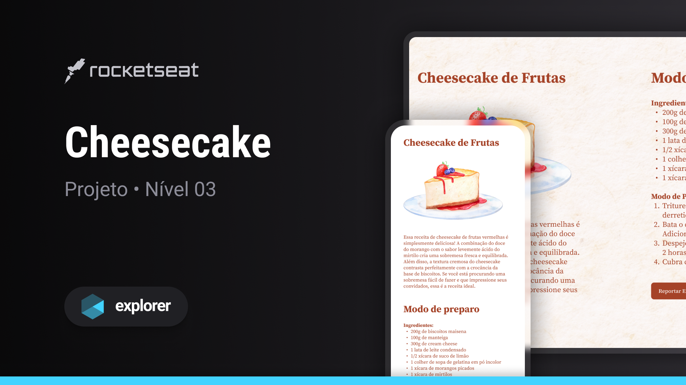

## 💻 Projeto

Esse é um projeto Web Responsivo de uma receita de  cheesecake.

## 🚀 Tecnologias

Esse projeto foi desenvolvido durante o curso Explorer da Rocketseat com as seguintes tecnologias:

- HTML
- CSS

## 🏷️ Layout

Você pode visualizar o layout do projeto através [desse link](https://www.figma.com/file/EWX6Iz3QTHvJ2kMoqYY1DD/Cheesecake-%E2%80%A2-Projeto-Explorer-(Community)?type=design&t=BJZp3NybPcwbUr0a-6).
É necessário ter uma conta do [Figma](https://www.figma.com).
